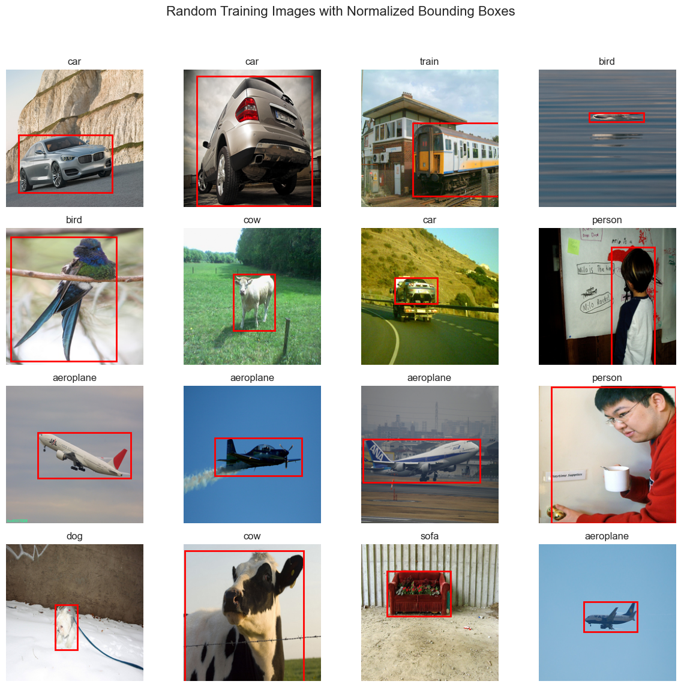

# NeuroVision

This project focused on object detection using the VOC dataset, which comprises nearly 9,000 images across 20 classes, with each image containing a single object and its corresponding bounding box. A convolutional neural network (CNN) model was developed, achieving a classification accuracy of 62%. This performance is significant, especially given the limited dataset size compared to other models trained on millions of images. The project utilized seven different CNN architectures and implemented various techniques, including hyperparameter optimization, data augmentation, and adjustments to filter sizes, kernel sizes, batch normalization, and max pooling. NeuroVision emphasizes the effectiveness of CNNs for localization and classification tasks, even when trained on smaller datasets, and enhances the understanding of key concepts like Intersection over Union (IoU) in the field of computer vision.

## 1. Data

The dataset used for this project is the VOC dataset, which consists of 20 classes. The dataset provides a rich set of images that facilitate training and evaluating object detection models.

### Class Distribution
The class distribution is illustrated in the following bar chart:

### Sample Images
Additionally, some sample images from the dataset, including their corresponding bounding boxes and labels, can be viewed below:

### Dataset Download
The VOC dataset can be downloaded from the following links:

- [Pascal VOC 2012 Dataset](http://host.robots.ox.ac.uk/pascal/VOC/voc2012/)
- [Pascal VOC 2007 Dataset](http://host.robots.ox.ac.uk/pascal/VOC/voc2007/)
