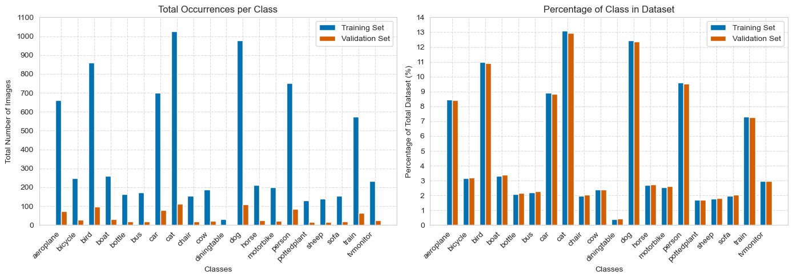
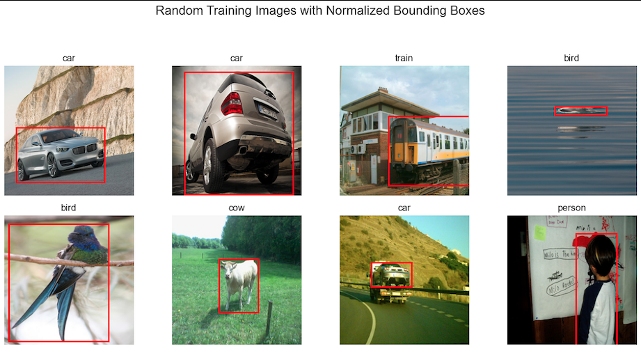
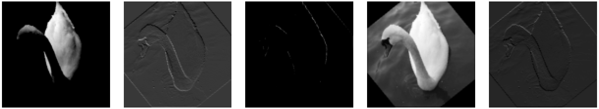
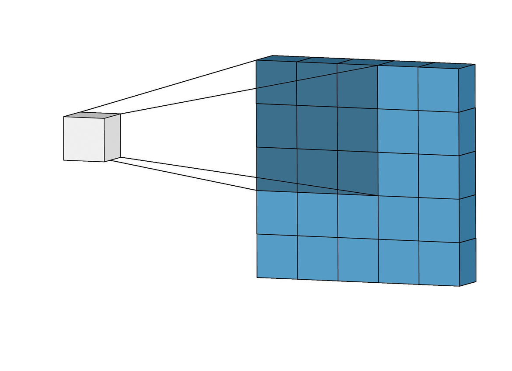

# NeuroVision

This project focused on object detection using the VOC dataset, which comprises nearly 9,000 images across 20 classes, with each image containing a single object and its corresponding bounding box. A convolutional neural network (CNN) model was developed, achieving a classification accuracy of 62%. This performance is significant, especially given the limited dataset size compared to other models trained on millions of images. The project utilized seven different CNN architectures and implemented various techniques, including hyperparameter optimization, data augmentation, and adjustments to filter sizes, kernel sizes, batch normalization, and max pooling. NeuroVision emphasizes the effectiveness of CNNs for localization and classification tasks, even when trained on smaller datasets, and enhances the understanding of key concepts like Intersection over Union (IoU) in the field of computer vision.

## Project Overview

#### 1. Data Preprocessing
- The dataset consisted of 8,725 images, each containing one object with labeled bounding boxes, split into 90% for training and 10% for validation.
- Images, labels, and bounding boxes were converted into NumPy arrays for smoother integration with PyTorch’s DataLoader.

#### 2. What is a CNN?
- A Convolutional Neural Network (CNN) is a deep learning model designed for image data that learns spatial hierarchies of features through convolutional layers.
- CNNs use filters to detect patterns, pooling layers to reduce dimensions, and fully connected layers for classification, enabling object recognition and bounding box prediction.

#### 3. Model Training - CNN Parameter Tuning
  - **Training Set Size**: Trained on subsets of 1,000, 2,500, 5,000, and 7,800 images to show the effect of data size.
  - **Convolutional Layers**: Tested CNNs with 1, 3, 5, and 7 layers to balance depth and accuracy.
  - **Augmentation Techniques**: Applied Gaussian noise, color jitter, and rotation to enhance generalization.
  - **Filter, Kernel, and Batch Sizes**: Tuned filter sizes, kernel sizes, and batch sizes for optimal performance.

#### 4. Transfer Learning with ResNet
- The ResNet model achieved higher accuracy, benefiting from features learned on larger datasets while adapting to the specific task.

#### 5. Model Results Analysis
- Each experiment was run for 100 epochs, evaluating models based on classification accuracy and bounding box MSE on the validation set. Accuracy trends over epochs were analyzed.
- Additional evaluations using confusion matrices derived F1 scores, precision, and recall for each class. Filters learned by the first convolutional layer were also visualized to gain insight into the early-stage feature extraction process.

#### 6. Hardware Specifications
- Training was conducted on a MacBook Air 2021 with an Apple M1 chip and 16GB of RAM, taking approximately 12 hours per training run due to limited computational resources.

## 1. Data Preprocessing

The dataset used for this project is the VOC dataset, which consists of 20 classes. The dataset provides a rich set of images that facilitate training and evaluating object detection models.

### Class Distribution
The class distribution is illustrated in the following bar chart:

### Sample Images
Additionally, some sample images from the dataset, including their corresponding bounding boxes and labels, can be viewed below:

### Dataset Download URLs
The VOC dataset can be downloaded from the following links:

- [Pascal VOC 2012 Dataset](http://host.robots.ox.ac.uk/pascal/VOC/voc2012/)
- [Pascal VOC 2007 Dataset](http://host.robots.ox.ac.uk/pascal/VOC/voc2007/)

## 2. What is a CNN?
A Convolutional Neural Network (CNN) is a specialized deep learning model designed for processing and analyzing image data. CNNs leverage convolutional layers to learn spatial hierarchies of features, enabling them to recognize patterns and structures within images.

#### Key Components of CNNs

1. **Filters**
   - Filters (also known as kernels) are small matrices that slide over the input image to perform convolution operations. Each filter is designed to capture specific features, such as edges, textures, or patterns.
  
2. **Kernel Size**
   - The kernel size determines the dimensions of the filter. Common choices are 3x3 or 5x5 pixels, which influence the level of detail captured during the convolution process.

3. **Scanning an Image**
   - As the filter moves across the image (a process known as convolution), it multiplies the filter values with the corresponding pixel values, producing a feature map that highlights the presence of specific features.
   - This scanning process allows CNNs to learn which features are most important for classifying objects.

  <h4>Image with Trained Filters Applied</h4>
  

  <h4>3x3 Kernel Size with Calculation &nbsp;&nbsp;&nbsp;&nbsp; CNN Image Scanning</h4>
  
  &nbsp;&nbsp;&nbsp;&nbsp;
  

#### How CNNs Work
- The input image is first passed through multiple convolutional layers, where filters scan the image and create feature maps.
- After convolution, pooling layers reduce spatial dimensions, decreasing computational complexity while retaining information.
- Finally, fully connected layers perform the final classification based on the extracted features.

In this project, CNNs were utilized to classify objects and predict their bounding boxes, enabling robust object recognition capabilities.

### 3. Model Training - CNN Parameter Tuning

In this section, we detail the parameter tuning experiments conducted during the training of our Convolutional Neural Networks (CNNs). The following parameters were systematically evaluated to assess their impact on model performance:

#### 3.1 Training Set Size
- **Sizes Tested**: 1,000, 2,500, 5,000, 7,800 images
- **Objective**: To analyze how varying the training dataset size affects the model's accuracy and generalization capabilities.

#### 3.2 Convolutional Layers
- **Layers Tested**: 1 layer, 3 layers, 5 layers, 7 layers
- **Objective**: To find an optimal balance between model depth and accuracy, determining how additional layers influence performance.

#### 3.3 Augmentation Techniques
- **Techniques Applied**: Gaussian Noise, Color Jitter, Rotation
- **Objective**: To enhance model generalization by introducing variations in the training data, thereby improving robustness against overfitting.

#### 3.4 Filter, Kernel, and Batch Sizes
- **Parameters Tuned**: Filter sizes, Kernel sizes, Batch sizes
- **Objective**: To identify the optimal configurations that lead to improved performance and convergence rates during training.

#### 3.5 Results and Observations
- After conducting the parameter tuning experiments, we observed the following:
  - **Training Set Size**: Increasing the dataset size generally improved model accuracy, but the improvements diminished beyond a certain point.
  - **Convolutional Layers**: Models with 5 layers consistently outperformed those with fewer or more layers in terms of validation accuracy.
  - **Augmentation Techniques**: Implementing augmentation significantly reduced overfitting, particularly with Gaussian noise.
  - **Optimal Configurations**: Through experimentation, we identified specific combinations of filter and kernel sizes that yielded the best results.

#### 3.6 Conclusion
The tuning of CNN parameters is crucial for achieving optimal model performance. Future work will involve further refinement of these parameters and exploration of additional techniques such as dropout and batch normalization.

