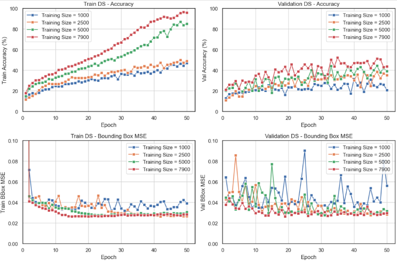

# NeuroVision

This project focused on object detection using the VOC dataset, which comprises nearly 9,000 images across 20 classes, with each image containing a single object and its corresponding bounding box. A convolutional neural network (CNN) model was developed, achieving a classification accuracy of 62%. This performance is significant, especially given the limited dataset size compared to other models trained on millions of images. The project utilized seven different CNN architectures and implemented various techniques, including hyperparameter optimization, data augmentation, and adjustments to filter sizes, kernel sizes, batch normalization, and max pooling. NeuroVision emphasizes the effectiveness of CNNs for localization and classification tasks, even when trained on smaller datasets, and enhances the understanding of key concepts in the field of computer vision.

## Project Overview

#### 1. Data Preprocessing
- The dataset consisted of 8,725 images, each containing one object with labeled bounding boxes, split into 90% for training and 10% for validation.
- Images, labels, and bounding boxes were converted into NumPy arrays for smoother integration with PyTorch’s DataLoader.

#### 2. What is a CNN?
- A Convolutional Neural Network (CNN) is a deep learning model designed for image data that learns spatial hierarchies of features through convolutional layers.
- CNNs use filters to detect patterns, pooling layers to reduce dimensions, and fully connected layers for classification, enabling object recognition and bounding box prediction.

#### 3. Model Training - CNN Parameter Tuning
  - **Training Set Size**: Trained on subsets of 1,000, 2,500, 5,000, and 7,800 images to show the effect of data size.
  - **Convolutional Layers**: Tested CNNs with 1, 3, 5, and 7 layers to balance depth and accuracy.
  - **Augmentation Techniques**: Applied Gaussian noise, color jitter, and rotation to enhance generalization.
  - **Filter, Kernel, and Batch Sizes**: Tuned filter sizes, kernel sizes, and batch sizes for optimal performance.

#### 4. Transfer Learning with ResNet
- The ResNet model achieved higher accuracy, benefiting from features learned on larger datasets while adapting to this specific task.

#### 5. Model Results Analysis
- Each experiment was run for 100 epochs, evaluating models based on classification accuracy and bounding box MSE on the validation set. Accuracy trends over epochs were analyzed.
- Additional evaluations using confusion matrices derived F1 scores, precision, and recall for each class. Filters learned by the first convolutional layer were also visualized to gain insight into the early-stage feature extraction process.

#### 6. Hardware Specifications
- Training was conducted on a MacBook Air 2021 with an Apple M1 chip and 16GB of RAM, taking approximately 12 hours per training run due to limited computational resources.

#### 7. Future Directions
- **Larger Dataset**: Expand the dataset for improved generalization and robustness.
- **Enhanced Computational Resources**: Use CPUs or TPUs to optimize model architectures, exploring deeper networks like ResNet.
- **Advanced Bounding Box Loss**: Implement IoU and Focal Loss to enhance localization accuracy and address class imbalance.

## 1. Data Preprocessing

The dataset used for this project is the VOC dataset, which consists of 20 classes. The dataset provides a rich set of images that facilitate training and evaluating object detection models.

### Class Distribution
The class distribution is illustrated in the following bar chart:

### Sample Images with Bounding Box
Additionally, some sample images from the dataset, including their corresponding bounding boxes and labels, can be viewed below:

### Dataset Download URLs
The VOC dataset can be downloaded from the following links:

- [Pascal VOC 2012 Dataset](http://host.robots.ox.ac.uk/pascal/VOC/voc2012/)
- [Pascal VOC 2007 Dataset](http://host.robots.ox.ac.uk/pascal/VOC/voc2007/)

## 2. What is a CNN?
A Convolutional Neural Network (CNN) is a specialized deep learning model designed for processing and analyzing image data. CNNs leverage convolutional layers to learn spatial hierarchies of features, enabling them to recognize patterns and structures within images.

#### Key Components of CNNs

1. **Filters**
   - Filters (also known as kernels) are small matrices that slide over the input image to perform convolution operations. Each filter is designed to capture specific features, such as edges, textures, or patterns.
  
2. **Kernel Size**
   - The kernel size determines the dimensions of the filter. Common choices are 3x3 or 5x5 pixels, which influence the level of detail captured during the convolution process.

3. **Scanning an Image**
   - As the filter moves across the image (a process known as convolution), it multiplies the filter values with the corresponding pixel values, producing a feature map that highlights the presence of specific features.
   - This scanning process allows CNNs to learn which features are most important for classifying objects.

**Image with Trained Filters Applied**  

|                     CNN Model Overview                     |          CNN Image Scanning (3x3 Kernel)          |
|:----------------------------------------------------------:|:-------------------------------------------------:|
| |  |

#### How CNNs Work
- The input image is first passed through multiple convolutional layers, where filters scan the image and create feature maps.
- After convolution, pooling layers reduce spatial dimensions, decreasing computational complexity while retaining information.
- Finally, fully connected layers perform the final classification based on the extracted features.

In this project, CNNs were utilized to classify objects and predict their bounding boxes, enabling robust object recognition capabilities.

## 3. Model Training - CNN Parameter Tuning

In this section, we detail the parameter tuning experiments conducted during the training of our Convolutional Neural Networks (CNNs). The following parameters were systematically evaluated to assess their impact on model performance:

#### 3.1 Training Set Size
- **Sizes Tested**: 1,000, 2,500, 5,000, 7,900 images
- **Takeaway**: Both training and validation accuracy greatly improved with increased images.
  

#### 3.2 Convolutional Layers
- **Layers Tested**: 1 layer, 3 layers, 5 layers, 7 layers
- **Takeaway**: To find an optimal balance between model depth and accuracy, determining how additional layers influence performance.

#### 3.3 Augmentation Techniques
- **Techniques Applied**: Gaussian Noise, Color Jitter, Rotation
- **Takeaway**: Improved generalization by introducing variations in the training data, thereby improving robustness against overfitting.
  

#### 3.4 Filter, Kernel, and Batch Sizes
- **Parameters Tuned**: Filter sizes, Kernel sizes, Batch sizes
- **Takeaway**: While filter sizes, kernel sizes, and batch sizes had a marginal impact on model performance, they hold potential for optimization in future fine-tuning efforts. It’s important to note that these parameters significantly influenced the model’s runtime and overall size, suggesting trade-offs between computational efficiency and potential performance gains.

#### 3.5 Results and Observations
- After conducting the parameter tuning experiments, we observed the following:
  - **Training Set Size**: Increasing the dataset size greatly improved model accuracy (from ~20% up to 40% on the validation set).
  - **Convolutional Layers**: Models with 5 or 7 Conv layers tended to perfect the train ds, however struggled to generalize as well.
  - **Augmentation Techniques**: Augmentation used to increase the training set diversity and reduce overfitting.

#### 3.6 Conclusion
Tuning CNN parameters is crucial for achieving optimal model performance. Future work should include more complex models - both deeper and more novel, such as residual layers, bottlenecks, dropout etc. 

## 4. Transfer Learning with ResNet

**Transfer learning** is a technique where a pre-trained model is used as the starting point for a different but related task. Instead of training a model from scratch, transfer learning allows leveraging the knowledge from models that were trained on large datasets. For this project, I utilized a pre-trained ResNet model, which was originally trained on the **ImageNet dataset**, consisting of **14 million images** from **1,000 different classes**.

In my experiment, I froze all the layers of the ResNet model except for the last one, which was fine-tuned to adapt to the specific task at hand. This approach allowed the model to retain the rich feature representations learned from large-scale data while adapting to my specific dataset more efficiently.

#### Key Features of ResNet Architecture:
- **Residual Blocks**: ResNet uses shortcut or skip connections that bypass one or more layers. This helps prevent the vanishing gradient problem, allowing very deep networks to train successfully.
- **Deep Networks**: ResNet architectures can be extremely deep, with ResNet-101 having 50+ layers, enabling the model to capture more complex patterns without performance degradation.

  

- **Results**: From the figure, the green line indicates that ResNet achieved a validation accuracy of over **90%** on the validation set.

## 5. Model Results Analysis

### Overview
- Each model was evaluated based on classification accuracy and bounding box Mean Squared Error (MSE) on the validation set.
- Key metrics such as F1 scores, precision, recall, and confusion matrices were analyzed to assess model performance.

### 1. Best Model Results
- **Model Architecture**: 

{ width=80% }

- **Accuracy**: 62% on the validation set.
- **Bounding Box MSE**: 0.27 for the best-performing model.`

| Confusion Matrix | Metrics CSV |
|-------------------|-------------|
|  |  |

### Understanding the Confusion Matrix

A confusion matrix is a tool used to evaluate the performance of a classification model. It provides a detailed breakdown of correct and incorrect predictions across different classes, making it easier to identify areas where the model excels or struggles. This matrix is particularly helpful for understanding model behavior beyond overall accuracy, allowing for a more nuanced assessment of performance.

1. **Overall Accuracy**: The model achieves 62% accuracy, with classes like aeroplane, cat, and train performing well (over 70%). However, classes such as dining table, bottle, cow, and chair are below 40%.

2. **Class Confusion**: The matrix shows interesting misclassifications, such as cats being predicted as dogs. This suggests a need for better feature differentiation.

3. **Underrepresented Classes**: Some classes are underrepresented, like dining table (4 instances) and potted plant (15). The percentage of each class is consistent in training and validation, indicating that more data could improve accuracy.

### Understanding Precision, Recall, and F1 Score

- **Precision**: Precision measures the accuracy of positive predictions, calculated as true positives divided by the total predicted positives. For example, if the model predicts 100 instances as aeroplanes and 90 of those are correct, the precision for aeroplanes is 0.90.

- **Recall**: Recall, or true positive rate, measures the ability to identify all relevant instances. It is calculated as true positives divided by the total actual positives. For instance, if there are 80 actual aeroplanes in the dataset and the model correctly identifies 60, the recall for aeroplanes is 0.75.

- **F1 Score**: The F1 score is the harmonic mean of precision and recall, providing a balanced measure of a model's performance.

### Key Insights from the Metrics Table

1. **Overall Model Performance**: The model has an overall accuracy of 62%, with a balanced weighted average precision of 0.62 and F1-score of 0.61. This indicates a reasonably reliable model, though improvements can be made for certain classes.

2. **Class-Specific Variability**: Performance varies significantly across classes. Classes like aeroplane (precision: 0.90) and train (F1-score: 0.84) perform well, while others like dining table (all metrics: 0.00) show a lack of predictive capability. This suggests the need for targeted data enhancement.

3. **Recall Discrepancies**: The recall scores for many classes are notably low, particularly for those with fewer instances (e.g., dining table, bottle). This implies that while the model identifies certain classes well, it struggles with underrepresented categories, leading to missed predictions.

### Bounding Box Evaluation Using Mean Squared Error (MSE)

In object detection tasks, bounding boxes are used to localize objects within an image. To assess the performance of bounding box predictions, Mean Squared Error (MSE) can be employed. MSE measures the average squared differences between predicted and actual bounding box coordinates, providing a quantitative evaluation of localization accuracy.

- **Formula**: MSE is calculated as follows:

  $$
  \text{MSE} = \frac{1}{n} \sum_{i=1}^{n}(y_i - \hat{y}_i)^2 
  $$

  where y_i is the true bounding box coordinate, y_hat_i is the predicted coordinate, and n is the total number of bounding boxes.

- **Interpretation**: A lower MSE value indicates better localization accuracy. If the predicted bounding boxes are closely aligned with the actual object locations, the MSE will be minimal, suggesting that the model effectively identifies object positions within the images.

Using MSE provides a straightforward way to evaluate bounding box predictions, helping to improve the performance of the object detection model over time.

## 6. Hardware Specifications

Training was conducted on a MacBook Air (2021) equipped with an Apple M1 chip and 16GB of RAM. The choice of hardware significantly impacted training times and model experimentation capabilities. Each training run took approximately 12 hours, reflecting the computational limits of the hardware and the complexity of the models used.

## 7. Future Work

### Overview
To enhance model performance and accuracy, several avenues for future work have been identified:

1. **Larger Dataset**: Expanding the dataset will provide more diverse examples, improving generalization and reducing overfitting, particularly for underrepresented classes.

2. **Optimized Hardware**: Utilizing CPU or TPU resources will facilitate more extensive experimentation and enable the use of deeper network architectures similar to ResNet, enhancing the model's learning capabilities.

3. **Deeper Neural Networks and Modern Approaches**: Implementing more sophisticated architectures like EfficientNet, DenseNet, and YOLO can leverage advancements in deep learning for improved accuracy and efficiency in both classification and object detection tasks.

4. **Improved Bounding Box Loss Functions**: Exploring advanced loss functions such as Intersection over Union (IoU) and Focal Loss can enhance bounding box predictions, leading to more accurate localization of objects within images.

## Backup Images:
Kernel Size Skew
{ width=0.8\linewidth }

Filter Size Skew
{ width=0.8\linewidth }

Batch Size Skew
{ width=0.8\linewidth }
