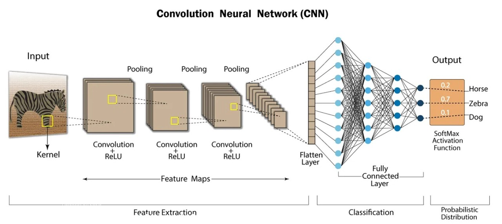

# NeuroVision

This project focused on object detection using the VOC dataset, which comprises nearly 9,000 images across 20 classes, with each image containing a single object and its corresponding bounding box. A convolutional neural network (CNN) model was developed, achieving a classification accuracy of 62%. This performance is significant, especially given the limited dataset size compared to other models trained on millions of images. The project utilized seven different CNN architectures and implemented various techniques, including hyperparameter optimization, data augmentation, and adjustments to filter sizes, kernel sizes, batch normalization, and max pooling. NeuroVision emphasizes the effectiveness of CNNs for localization and classification tasks, even when trained on smaller datasets, and enhances the understanding of key concepts like Intersection over Union (IoU) in the field of computer vision.
